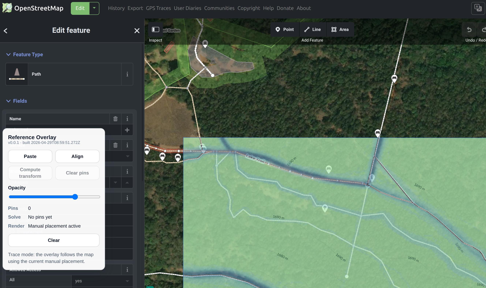

# id-overlay

`id-overlay` is a Chromium-first browser extension that adds a movable screenshot overlay to the OpenStreetMap iD editor.

It is meant for one narrow workflow:
- paste a reference screenshot over the map
- align it manually
- place pins to register screenshot pixels to map locations
- compute a transform
- trace in iD with the overlay following the map



## Current Scope

- targets `https://www.openstreetmap.org/edit?editor=id`
- runs as a Manifest V3 content-script extension
- supports two modes:
  - `Align`: move/scale/rotate the overlay and edit pins
  - `Trace`: leave the overlay passive while tracing in iD

The current alignment workflow is:
- paste an image
- move/scale/rotate until it roughly matches
- double-click to add or remove pins
- click `Compute transform`
- switch to `Trace`

## Load In Chromium

1. Build the extension:

```bash
npm run build:chrome
```

2. Open `chrome://extensions`
3. Enable `Developer mode`
4. Click `Load unpacked`
5. Select [`dist`](dist)

Then open `https://www.openstreetmap.org/edit?editor=id`.

## Development

Install dependencies:

```bash
npm install
```

Build:

```bash
npm run build:chrome
```

Run tests:

```bash
npm test
```

Targeted test layers:

```bash
npm run test:unit
npm run test:integration
npm run test:contracts
npm run test:build
```

## Repo Layout

- [`src/content`](src/content): DOM integration, panel, overlay, page adapter
- [`src/core`](src/core): state, transitions, transforms, presentation, storage
- [`scripts`](scripts): build tooling
- [`test`](test): unit, integration, contract, and build tests
- [`notes`](notes): design and refactor notes

## Status

This repo is still intentionally narrow:
- Chromium first
- no packaged release flow yet
- no cross-browser manifest build yet
- focused on strict state/transition ownership and test coverage before broader feature work
