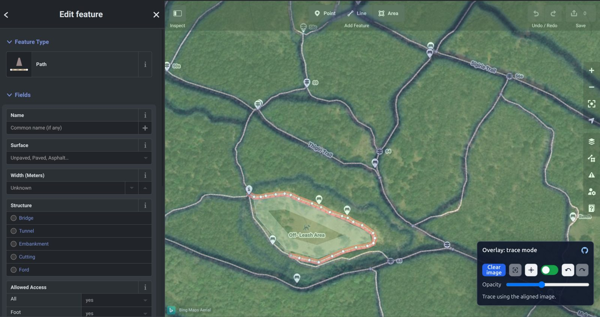

# id-overlay

`id-overlay` is a Chromium extension for the OpenStreetMap iD editor. It lets
you place a reference image over the map, line it up, and then trace from it
while editing in iD.

The project is intentionally narrow: it targets the iD editor on
`openstreetmap.org`, builds as an unpacked Chromium extension, and focuses on
making the overlay behavior predictable.



## What it does

The normal workflow is:

1. Open the OpenStreetMap iD editor.
2. Paste a reference image.
3. Use `Align` mode to line the image up with the map.
4. Switch to `Trace` mode.
5. Trace in iD while the image follows the map.

There are two modes:

- `Align` is for positioning the reference image.
- `Trace` is for editing the map. The overlay becomes passive, and iD receives
  the normal map interactions.

## Controls

The panel floats over the editor. You can drag the panel by its title bar. The
panel position is remembered, but if the panel would go off-screen it is
temporarily kept inside the viewport.

The panel title reports the current overlay state, for example whether there is
no image or whether the overlay is in `Align` or `Trace` mode.

The main button is context-sensitive:

- `Paste` starts image input. Click it, then press `Ctrl+V` or `Cmd+V`.
- `Clear image` arms removal. Click it again while armed to remove the current
  image, placement, and pins.

The opacity slider changes only image transparency. It does not move, scale, or
rotate the overlay.

The small icon buttons beside the main button are:

| Button | Result |
| --- | --- |
| Center overlay in view | Replaces the overlay placement so it is centered in the current map viewport. This is undoable. |
| Center map on overlay | Pans and zooms the map so the current overlay is centered. This changes the map view, not the overlay placement. |
| Mode switch | Switches between `Trace` and `Align`. |
| Undo / redo | Replays undoable overlay, image, pin, and fit changes. |

The status line reports the latest important state or result. If the message is
long and the panel is near the bottom of the screen, the panel slides upward so
the whole panel stays reachable.

### Align mode

Use `Align` when the image needs to be positioned or registered to the map.
Plain map gestures keep working: dragging and wheel zooming move the map, and
the overlay follows the map. Use modifiers when you want to edit only the
overlay.

| Control | Result |
| --- | --- |
| Drag | Pan the map; the overlay follows the map |
| `Shift` + drag | Move only the overlay |
| `Ctrl` / `Alt` + drag | Disabled transform drag; the cursor changes, but no gesture is committed |
| Wheel | Zoom the map; the overlay follows the map |
| `Ctrl` + wheel | Scale only the overlay around the cursor |
| `Alt` + wheel | Rotate only the overlay around the cursor |
| Double-click the overlay | Add a pin at that image/map point |
| Double-click an existing pin | Remove that pin |
| Switch to `Trace` | Fit the overlay from the current pins, when possible |

Pins are correspondence points. A pin says: this point on the image belongs at
this point on the map. After there are enough useful pins, switching to `Trace`
computes a placement that stays tied to the map as you pan and zoom.

You can also align manually without pins. A manually placed overlay is still
map-locked in `Align` and `Trace` once it has been placed against a live map
view.

### Trace mode

Use `Trace` when you want to edit in iD.

| Control | Result |
| --- | --- |
| Drag the map | Pan the map; the overlay follows |
| Wheel the map | Zoom the map; the overlay follows |
| Switch to `Align` | Return to overlay positioning |

In `Trace`, the overlay should not block normal iD editing. The image stays
registered to the map as the map moves.

### Practical workflow

1. Open iD at the area you want to work on.
2. Click `Paste`, then paste a screenshot from your clipboard.
3. In `Align`, use plain drag/wheel to move the map until the area is visible.
4. Use `Shift` + drag, `Ctrl` + wheel, and `Alt` + wheel to move, scale, and
   rotate the overlay. The cursor changes for each modifier so the active
   posture is visible before you commit a wheel gesture.
5. If useful, double-click matching points to add pins. Switch to `Trace` to
   compute a pinned fit.
6. Use the center-overlay button when the image has drifted out of the visible
   viewport.
7. Use the center-map button when the overlay is placed correctly but the map
   view should move back to it.
8. In `Trace`, edit normally in iD. The overlay follows pan and zoom.

## Install in Chromium

This extension is distributed as an unpacked Chromium extension.

That means:

- it is not installed from the Chrome Web Store
- the release zip is not a one-click installer
- you must extract the zip, then load the extracted folder in Chromium

Supported browsers today:

- Google Chrome
- Chromium

Other Chromium-based browsers may work, but they are not the supported target
yet.

### Install from a release zip

1. Open the releases page:
   `https://github.com/numpde/id-overlay/releases`
2. Download the latest `id-overlay-chrome-<version>.zip` asset.
3. Extract the zip somewhere you want to keep the extension.
4. Open `chrome://extensions`.
5. Enable `Developer mode`.
6. Click `Load unpacked`.
7. Select the extracted extension folder, not the zip file.
8. Open `https://www.openstreetmap.org/edit?editor=id`.

If Chromium says files are missing, you probably selected the zip itself, the
wrong parent folder, or a folder that was moved after loading.

## Permissions

The extension asks for a narrow set of permissions:

- `storage`: lets the extension save its own state, such as overlay placement,
  opacity, pins, and panel position.
- `https://www.openstreetmap.org/*`: lets the extension run on OpenStreetMap
  pages.

The content script is limited to:

- `https://www.openstreetmap.org/edit*`

Loading the extension in Chromium developer mode does not grant extra extension
permissions. Developer mode only adds browser controls for inspecting,
reloading, and debugging the extension.

The extension does not request:

- access to all websites
- `tabs`
- `activeTab`
- clipboard extension permissions
- cookies, history, downloads, or native messaging

The important caveat is that a content script running on the iD editor page can
read and modify that page while it is active there. In practice, the permission
boundary is OpenStreetMap/iD plus extension storage, not the whole browser.

### Recommended: build in Docker

Use the Docker toolchain for normal development and release checks. It keeps the
Node/npm toolchain out of the host environment and makes local verification
match the project tooling more closely.

The install step builds the toolchain image and runs `npm ci` inside the
container. This step needs network access:

```bash
./scripts/docker-release-checks.sh --install
```

The normal check step reuses the cached image, runs without network, drops Linux
capabilities, uses a read-only container filesystem, and writes only through the
mounted repository plus a temporary filesystem:

```bash
./scripts/docker-release-checks.sh
```

That command runs the main tests, flow witnesses, flow artifact audit, Chromium
extension build, and release zip packaging. It writes:

- [`dist`](dist), for local unpacked-extension testing
- `release/id-overlay-chrome-<version>.zip`, for release upload or manual
  install testing

If the Dockerfile changes, refresh the image explicitly:

```bash
./scripts/docker-release-checks.sh --build
```

Then load the generated [`dist`](dist) folder:

1. Open `chrome://extensions`.
2. Enable `Developer mode`.
3. Click `Load unpacked`.
4. Select [`dist`](dist).
5. Open `https://www.openstreetmap.org/edit?editor=id`.

### Host Node fallback

Host Node works too, but it is no longer the recommended development path.

Install dependencies:

```bash
npm install
```

Build the extension:

```bash
npm run build:chrome
```

## Development

The recommended full local check is containerized:

```bash
./scripts/docker-release-checks.sh
```

If you are using the host Node fallback, run the main test suite:

```bash
npm test
```

Build the Chromium package on the host:

```bash
npm run build:chrome
```

Useful focused checks:

```bash
npm run test:hex:class-a
npm run test:hex:class-b
npm run test:hex:class-c
npm run test:hex:candidates
npm run test:flow
```

Tests are grouped by how much design weight they carry:

- `class-a`: settled behavior and architecture rules
- `class-b`: strong behavior examples that still leave some design room
- `class-c`: suspicious or speculative tests kept away from stronger claims
- `unclassified`: proposals that still need to be judged

Some tests are flow witnesses: they exercise a user or system flow and can emit
trace files. Those traces help review whether the flow has clear starting
points, steps, and outcomes.

## Repository layout

- [`hex/domain`](hex/domain): pure domain rules such as placement,
  registration, opacity, and image policy
- [`hex/application`](hex/application): application state, commands, effects,
  history, validation, and view models
- [`hex/ports`](hex/ports): browser-neutral port definitions
- [`hex/adapters`](hex/adapters): browser, OpenStreetMap/iD, storage, timer,
  input, overlay, and panel adapters
- [`hex/bootstrap`](hex/bootstrap): extension composition and runtime wiring
- [`hex/test`](hex/test): grouped tests and flow witnesses
- [`src/content/content-loader.js`](src/content/content-loader.js): the small
  content-script loader used by the packaged extension
- [`scripts`](scripts): build and manifest tooling
- [`notes`](notes): design notes and retained legacy evidence
- [`docs`](docs): screenshots and project documentation assets

The old legacy app has been removed from the working tree. The retained lessons
from it are summarized in
[`notes/006_legacy_retention_insights.txt`](notes/006_legacy_retention_insights.txt).

## CI and releases

GitHub Actions runs CI on pushes to `main` and on pull requests. CI installs
dependencies and runs:

```bash
npm test
```

The release workflow runs for tags named `v*`. It tests, builds [`dist`](dist),
creates a zip named `id-overlay-chrome-<version>.zip`, and publishes it as a
GitHub Release asset.

The extension version lives in [`manifest.chrome.json`](manifest.chrome.json).
To publish a new release:

1. Update the `version` in [`manifest.chrome.json`](manifest.chrome.json).
2. Add release notes under [`docs/releases`](docs/releases), using the tag name
   as the file name.
3. Commit the changes.
4. Create and push a matching tag:

```bash
git tag v0.0.3
git push origin main --tags
```

Prepared release tag:

- `v0.0.3`

Release notes are kept under [`docs/releases`](docs/releases). If a file named
after the tag exists, for example [`docs/releases/v0.0.3.md`](docs/releases/v0.0.3.md),
the release workflow uses that file as the GitHub Release body.

## Status

This is still a focused tool, not a general browser extension platform.

Current limits:

- Chromium-extension browsers only. The supported targets are Google Chrome and
  Chromium; other Chromium-based browsers may work but are not tested as release
  targets.
- OpenStreetMap iD only
- unpacked-extension install path
- no Firefox or Safari package yet
- no Chrome Web Store distribution yet
